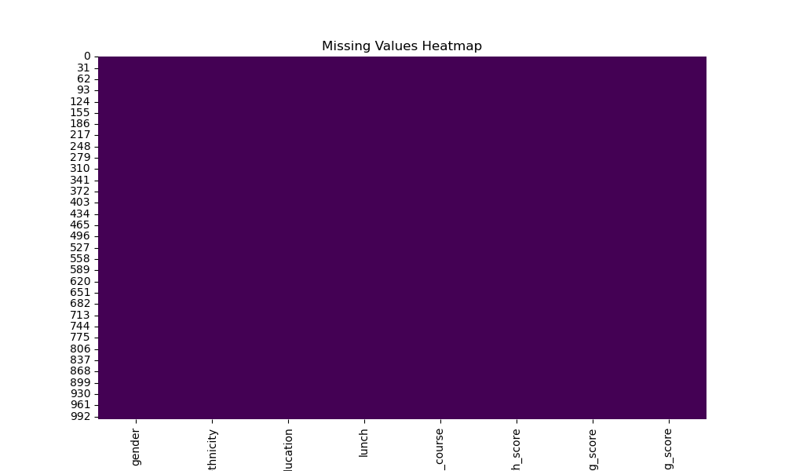
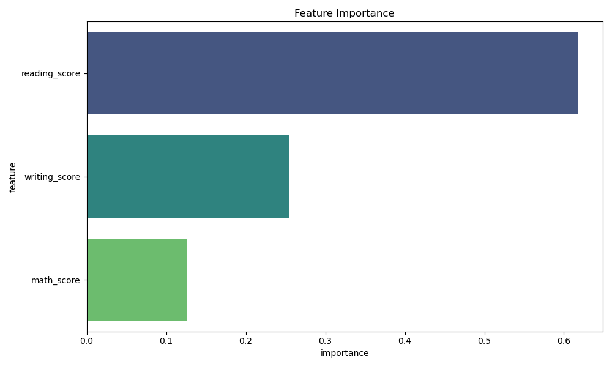

# End-to-End Machine Learning Project

## 📌 Overview
This repository contains an end-to-end Machine Learning project that demonstrates the complete machine learning lifecycle, including data ingestion, preprocessing, exploratory data analysis (EDA), feature engineering, model training, evaluation, model persistence, and deployment using a web application.

The primary goal of this project is to simulate a real-world ML workflow and showcase best practices followed in industry-level machine learning projects.

---

## 🎯 Problem Statement
The objective of this project is to build a machine learning model that learns meaningful patterns from structured tabular data and makes accurate predictions on unseen inputs.

This project focuses on:
- Data cleaning and preprocessing
- Handling missing values
- Feature scaling and transformation
- Model training and evaluation
- Saving trained models for reuse
- Deploying the model using a web-based interface

---

## 📂 Dataset
- Format: CSV
- Type: Structured tabular dataset
- Source: Public / Self-collected
- Target Variable: target

Dataset location:
data/raw/

---

## 🔍 Exploratory Data Analysis & Feature Visualization
EDA and feature analysis are performed using Python scripts. Visualizations are saved in the `images/` folder:

### Available Visualizations
- **Missing Values Heatmap:** `images/missing_values.png`  
- **Feature Correlation Matrix:** `images/correlation_matrix.png`  
- **Feature Distributions:** `images/{feature}_distribution.png`  
- **Feature Importance Plot:** `images/feature_importance.png`  

These scripts are located in `src/`:
- `eda_visualization.py` → Generates EDA plots  
- `feature_importance.py` → Generates feature importance plots  

Example:  

  
  

---

## 🛠️ Tech Stack
- Programming Language: Python
- Data Analysis: Pandas, NumPy
- Visualization: Matplotlib, Seaborn
- Machine Learning: Scikit-learn
- Deployment: Flask
- Version Control: Git and GitHub

---

## ⚙️ Installation and Setup

1. Clone the repository  
git clone https://github.com/Vedantika1705/ML-project.git  
cd ML-project  

2. Create a virtual environment  
python -m venv venv  
source venv/bin/activate (Linux / Mac)  
venv\Scripts\activate (Windows)  

3. Install dependencies  
pip install -r requirements.txt  

---

## 🚀 How to Run the Project

Train the model  
python src/model_training.py  

Evaluate the model  
python src/model_evaluation.py  

Run the web application  
python app/app.py  

Open your browser and visit:  
http://127.0.0.1:5000/

---

## 📊 Model Performance
The model is evaluated using:
- Accuracy
- Precision
- Recall
- F1-score

Evaluation results are printed in the console and supported by confusion matrices and classification reports.

---

## 📈 Results and Observations
- The trained model performs well on unseen data
- Feature scaling improves stability
- Modular structure allows easy experimentation
- Web interface enables real-time predictions

---

## 🔮 Future Improvements
- Hyperparameter tuning using GridSearchCV or RandomizedSearchCV
- Cross-validation for better generalization
- Feature engineering and feature selection
- Model versioning using MLflow or DVC
- Cloud deployment (AWS, GCP, Azure)
- CI/CD pipeline using GitHub Actions
- Logging and monitoring

---

## 👩‍💻 Author
Vedantika Varnekar  
GitHub: https://github.com/Vedantika1705  
LinkedIn: Add your LinkedIn profile link here

---

## ⭐ Acknowledgement
If you find this project useful, consider starring the repository.
Feedback and suggestions are always welcome.
